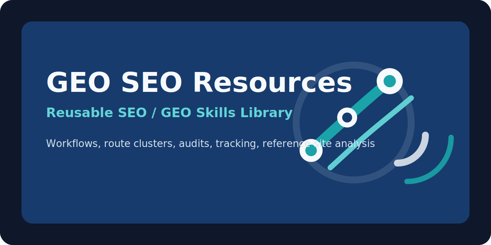

# GEO SEO Resources

[English](./README.md) | [简体中文](./README.zh-CN.md) | [繁體中文](./README.zh-Hant.md) | [日本語](./README.ja.md)

  

Third-party SEO and GEO resources for discoverable, AI-readable reference documentation sites.

This repository packages public-safe examples, GEO notes, `llms.txt` patterns, schema references, sample audit outputs, and a reusable SEO/GEO skill library. Illustrative URLs use the reserved domain `example.org`; replace them with your own live site when you apply these patterns.

## Languages And Formats

- **README translations**: English (this file), Simplified Chinese, Traditional Chinese, and Japanese use the same structure; switch via the links above.
- **Body documentation**: Most durable guides under `docs/` are written in English so links stay stable across tools.
- **Agent skills**: Directory names and `SKILL.md` bodies are English-first to match Cursor, Codex, and Claude Code conventions.
- **License**: See [`LICENSE`](LICENSE) (MIT). Copyright **Elser AI Limited**. GitHub contact: [@wchklaus97](https://github.com/wchklaus97).

## Lightweight Quality Checks (Not CI/CD)

This is a **documentation and skills** repository. There is **no** application build, release train, or deployment pipeline here.

What exists instead:

- A small **GitHub Actions** workflow ([`.github/workflows/ci.yml`](.github/workflows/ci.yml)) that runs on push and pull requests: Markdown lint, a targeted link check on selected paths, and validation of the sample JSON under `reports/`.
- The same checks can be run locally; see [`docs/ci-and-quality.md`](docs/ci-and-quality.md).

## How To Read This Repository

- **Third-party lens**: Content is educational reference material maintained independently of any product vendor.
- **No affiliation**: This is not an official, authorized, or partnered repository for any specific product or trademark.
- **Snapshots age**: Route lists, metrics, and examples may drift as the live site changes; verify on the destination site when it matters.
- **No warranties**: Examples and skills are provided as-is for research and operations workflows.

## Positioning

- This is a third-party resource repository.
- It is not an official, authorized, or partnered property of any single vendor or product.
- Its purpose is to help researchers, operators, and content teams understand how a public reference documentation site can be organized for SEO, GEO, and AI-readable discovery.

## Primary Illustrative Routes

These are the first routes this repo uses as **documentation placeholders** (`example.org`):

- [Guides hub](https://www.example.org/guides?utm_source=github&utm_medium=referral&utm_campaign=geo_seo_resources)
- [Prompt templates hub](https://www.example.org/prompt-templates?utm_source=github&utm_medium=referral&utm_campaign=geo_seo_resources)
- [Product overview guide](https://www.example.org/guides/product-overview?utm_source=github&utm_medium=referral&utm_campaign=geo_seo_resources)
- [Advanced prompt techniques](https://www.example.org/prompt-templates/advanced-prompt-tips?utm_source=github&utm_medium=referral&utm_campaign=geo_seo_resources)
- [Illustrative `llms.txt`](https://www.example.org/llms.txt?utm_source=github&utm_medium=referral&utm_campaign=geo_seo_resources)

## What This Repo Contains

- `docs/llms-txt-guide.md`: how a reference site can structure its AI-readable content index
- `docs/schema-examples.md`: public-safe schema ideas and mapping notes
- `docs/citability-checklist.md`: how to improve AI-citation readiness for guide and prompt-template pages
- `docs/reference-site-examples.md`: a curated map of the first routes to promote (illustrative URLs)
- `docs/report-samples.md`: sample GEO audit outputs and how to interpret them
- `docs/measurement-plan.md`: GitHub referral UTM rules and measurement notes
- `docs/skills-index.md`: mirrored skill catalog for Cursor, Codex, and Claude Code
- `docs/skill-route-inventory.md`: mapping from legacy workspace names to generic skills and example slugs
- `docs/repository-overview.md`: repository summary, current structure, and next actions
- `docs/ci-and-quality.md`: CI scope, quality checks, and local validation notes
- `.cursor/skills/agent-skills-index.md`: canonical in-repo skill index
- `examples/reference-route-map.md`: path-level information map (no UTM or README placement rules)
- `reports/reference-geo-audit-sample.md`: public-safe GEO summary
- `reports/reference-geo-audit-sample.json`: structured sample audit data

## Live GEO Snapshot

These sample signals follow the same shape as a typical reference documentation audit (illustrative metrics):

- `llms.txt`: present and valid
- `llms.txt` links: `57`
- guide overview citability: `40.6 / 100`
- prompt-template citability: `34.0 / 100`

See [reports/reference-geo-audit-sample.md](reports/reference-geo-audit-sample.md) for the summarized interpretation.

## Why This Repo Exists

The repo works as a search-discoverable resource layer:

- it gives GitHub users useful GEO and SEO examples
- it provides proof assets such as route maps and sample reports
- it routes interested readers toward information-rich documentation pages first (swap in your real domain)
- it keeps commercial/self-identity links clearly secondary

## Generic Skill Library

This repo now includes a reusable skill layer for:

- `Cursor`
- `Codex`
- `Claude Code`

The canonical copies live in `.cursor/skills/`, with thin adapters in `codex/skills/` and `.claude/skills/`.

The current implemented generic skills include:

- browser discovery and SEO analysis
- site-structure and landing-page SEO analysis
- reference-site analysis
- capability-page workflows
- site SEO verify-to-generate workflows
- SEO growth and tracking workflows
- route-cluster skills for capabilities, guides, and prompt templates
- OG preview generation
- referral traffic analysis
- video-to-story workflows

## Safe Linking Policy

Primary outbound links in your fork should go to the public documentation site you are actually analyzing or promoting.

Secondary owner links may appear in neutral placements such as:

- `About the team`
- `More tools by our team`
- `Contact our team`

They should not be phrased as the natural next step of a specific vendor workflow.

## Related Sites (Background Context)

- **[example.org](https://www.example.org/)** — IETF-reserved documentation domain used only as a **URL placeholder** in this repository’s examples; it is not a live product site tied to these workflows.
- **[elser.ai](https://www.elser.ai/?utm_source=github&utm_medium=referral&utm_campaign=geo_seo_resources_identity)** — broader tooling and systems from the maintainers’ side; optional context, not a required step for the examples here.

Neither listing is an endorsement; they are orientation points for readers who want placeholder URL semantics or sibling tooling context.

## Maintainers

Primary GitHub contact: [@wchklaus97](https://github.com/wchklaus97). This repository is maintained in the context of SEO, GEO, and AI-readable content systems. For neutral secondary context, see **Related sites** above.

## Next Reading

- [LLMS.txt guide](docs/llms-txt-guide.md)
- [Citability checklist](docs/citability-checklist.md)
- [Schema examples](docs/schema-examples.md)
- [Reference site route examples](docs/reference-site-examples.md)
- [Report samples](docs/report-samples.md)
- [Measurement plan](docs/measurement-plan.md)
- [Skills index](docs/skills-index.md)
- [Skill and route inventory](docs/skill-route-inventory.md)
- [Repository overview](docs/repository-overview.md)
- [CI and quality](docs/ci-and-quality.md)
